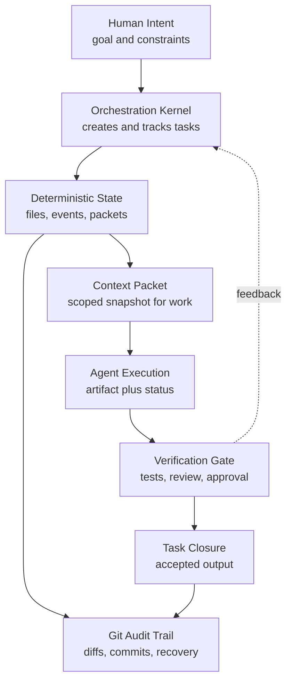

# Git Orchestration Concept

This repo is a small conceptual sketch of a deterministic orchestration layer for agentic work.

The core idea: let models think, but do not let chat memory be the source of truth. Work should live in a simple file-backed system that can be reviewed, verified, recovered, and versioned with Git.

## The Pattern

1. A human or system defines an objective.
2. The orchestration kernel creates explicit tasks.
3. Agents receive scoped context packets and produce artifacts.
4. State changes are written as files and append-only events.
5. Verification gates completion.
6. Git records the trail: what changed, when, by whom, and why.

Git is not the brain of the system. It is the audit layer.

## Diagram

Design rule: if correctness, recovery, or auditability matters, it belongs in deterministic state, not only in chat.

## Conceptual Components

- Human intent: the goal, priority, constraints, and review authority.
- Orchestration kernel: the deterministic control layer that owns task truth.
- File state: task records, event logs, context packets, and artifact references.
- Agent work: scoped execution by models or tools.
- Verification: tests, review, approval, or a hybrid gate before closure.
- Git history: commits, diffs, rollback points, and human-readable audit.

## Why This Matters

Agent systems fail in predictable ways: sessions reset, context disappears, outputs exist without closure, and nobody knows which task is actually done.

This pattern gives the non-deterministic parts of the system a deterministic floor:

- task identity is explicit
- ownership is explicit
- transitions are governed
- verification is separate from production
- recovery does not depend on remembering the chat

## Status

Conceptual prototype. This is intentionally not a comprehensive framework or finished product.
